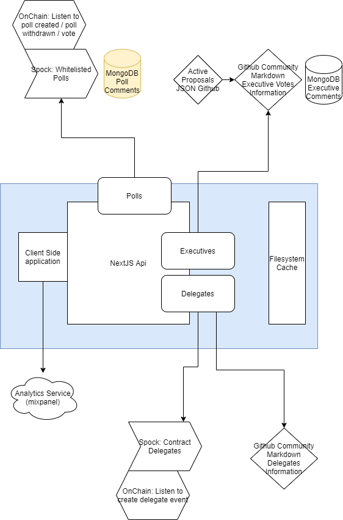

<h1  align="center"  style="margin-top: 1em; margin-bottom: 3em;">

<p><a  href="https://vote.makerdao.com/"></a></p>

<p>Maker Governance Portal</p>

</h1>

This the repo containing the code for the [Maker Governance Portal](https://vote.makerdao.com). The Maker Governance Portal is an open-source interface for governance of the Maker protocol.

### To run locally:

While the portal is hosted by MakerDAO at https://vote.makerdao.com, it can also be run by anyone on their local machine.

In order to run the project locally, you must have the following installed on the machine:

- Node, version 14 or greater ([install](https://nodejs.dev/learn/how-to-install-nodejs))

To get started, clone the repository to the desired directory and then navigate into the project folder:

```bash
# clones repo
git clone https://github.com/makerdao/governance-portal-v2.git

# changes directory to cloned project folder
cd governance-portal-v2
```

Next, install the project's dependencies using [npm](https://docs.npmjs.com/about-npm) or [yarn](https://yarnpkg.com/getting-started):

#### Using npm:

```bash

# installs dependencies
npm install

# builds eth-sdk for interacting with contracts
npm run build-sdk

# runs the application on localhost:3000
npm run dev
```

#### Or, if using yarn:

```bash

# installs dependencies
yarn

# builds eth-sdk for interacting with contracts
yarn build-sdk

# runs the application on localhost:3000
yarn dev

```

At this point, you should be able to access the application by going to the address `http://localhost:3000` in your browser.

### Additional configuration overview:

The portal seeks to rely on on-chain data as much as possible and to minimize reliance on data stored on centralized servers. However, due to the large volume of data that is relevant to Maker governance, fetching this data from on-chain is both time and resource-intensive. In order to improve the user's experience, some reliance on third-party services have been added. These include:

- [GitHub](https://github.com/makerdao/community/tree/master/governance) for storing markdown related to [polls](https://github.com/makerdao/community/tree/master/governance/polls), [executives](https://github.com/makerdao/community/tree/master/governance/votes), and [recognized delegates](https://github.com/makerdao/community/tree/master/governance/delegates)
- MongoDB for storing comments related to votes on polls and executives

The portal uses the [ethers.js](https://github.com/ethers-io/ethers.js/) library in order to communicate with the Ethereum network. Ethers works closely with an ever-growing list of third-party providers in order to provide on-chain data to web applications. By default, ethers provides default API keys to plug in to these service providers. However, these API keys can quickly become rate-limited when too many requests are made. In order to prevent this, it is recommended that you sign up and add your own API keys to the configuration for [Alchemy](https://docs.alchemy.com/reference/ethereum-api-quickstart), [Infura](https://docs.infura.io/infura/networks/ethereum/how-to/secure-a-project/project-id), [Etherscan](https://info.etherscan.com/api-keys/), and [Pocket](https://docs.pokt.network/home/#use-pocket-networks-rpc).

Due to the large volume of data that is constantly being fetched and displayed in the portal, we use caching in order to cache various network responses for a limited amount of time. This helps to reduce the load of networking calls to various APIs. This feature can be configured to be on or off.

### Configuration steps:

To begin, create a local `.env` file in the project's root directory. The `.env.sample` file can be used as a template.

The following configuration values can be added to the `.env` file:

#### Recommended:

- Set `INFURA_KEY` to a valid [Infura](https://docs.infura.io/infura/networks/ethereum/how-to/secure-a-project/project-id) API key for ethers provider to use

- Set `ALCHEMY_KEY` to a valid [Alchemy](https://docs.alchemy.com/reference/ethereum-api-quickstart) API key for ethers provider to use

- Set `ETHERSCAN_KEY` to a valid [Etherscan](https://info.etherscan.com/api-keys/) API key for ethers provider to use

- Set `POCKET_KEY` to a valid [Pocket](https://docs.pokt.network/home/#use-pocket-networks-rpc) API key for ethers provider to use

- Set `GOERLI_FORK_API_KEY` to a valid [Infura](https://docs.infura.io/infura/networks/ethereum/how-to/secure-a-project/project-id) API key for Hardhat to use during e2e testing

- Set `GITHUB_TOKEN` to fetch polls, executives, and recognized delegates information from GitHub (optionally set `GITHUB_TOKEN_2` and `GITHUB_TOKEN_3`)

- Set `MONGODB_URI` to a full MongoDB uri (ex: `mongodb+srv://...`)

- Set `MONGODB_COMMENTS_DB` the MongoDB db name to be used for vote comments

- Set `USE_CACHE` to true if you want to use cache, if `REDIS_URL` is set it will use REDIS otherwise filesystem cache

- Set `NEXT_PUBLIC_MIXPANEL_DEV` to the valid Mixpanel dev environment API key

- Set `NEXT_PUBLIC_MIXPANEL_PROD` to the valid Mixpanel prod environment API key

#### Optional:

- Set `MIGRATION_WEBHOOK_URL` for sending migration requests to discord

- Set `DASHBOARD_PASSWORD` for adding protection to the `/dashboard` route.

### Architecture diagram



### Tests

The Governance portal includes two test suites: Jest and Cypress

Jest tests under the folder `__tests__` currently execute unit tests of the platform. The e2e Cypress tests are under the `cypress` folder.

#### Test commands

Jest:

```

- npm run test -> runs Jest tests on livereload mode

- npm run test:ci -> runs all the Jest tests

```

Cypress:

```

- npm run e2e -> opens a Cypress browser for the e2e

- npm run e2e:headless -> runs e2e tests in a headless manner, for CI systems

```

#### Goerli fork

By default, e2e tests run on a fork of Goerli. We do this because the governance contracts are deployed in Goerli for testing purposes. To run the fork of Goerli on the localhost:8545 (chain id: 31337), execute:

```

npm run hardhat

```

Note: Make sure to fill in the GOERLI_FORK_API_KEY environment variable. After the network is running you can execute `npm run e2e` to execute the test suite.

You can use this local network from MetaMask, by switching to the "localhost:8545" network, with chain ID: `31337`. In order to get a wallet with some MKR and ETH you can run the script: `npm run fund` that will send some MKR and ETH to the first 50 wallets under the `/cypress/support/constants/keypairs.json`.

For more information about the fund process, take a look at `/scripts/setup.js`

**Writing e2e**:

Please refer to: https://docs.cypress.io/guides/references/best-practices and check current test examples under the cypress folder.

**Windows support**

If you are using Windows and WSL you will need to install XLaunch to be able to launch a client for the UI.

### CI/CD

The CI/CD system is integrated with Github Actions.

After each push the system will execute:

- Lint, verify type consistency

- Unit test, execute Jest test suite

- E2E, executy cypress test suite and record results at https://dashboard.cypress.io/projects/uckcr1/runs

```

yarn start:ci

```

The command `yarn start:ci` launches a detached process with hardhat, executes e2e in a headless mode and kills the hardhat process.

### Contributing

See our [contributing guide](./CONTRIBUTING.md).
